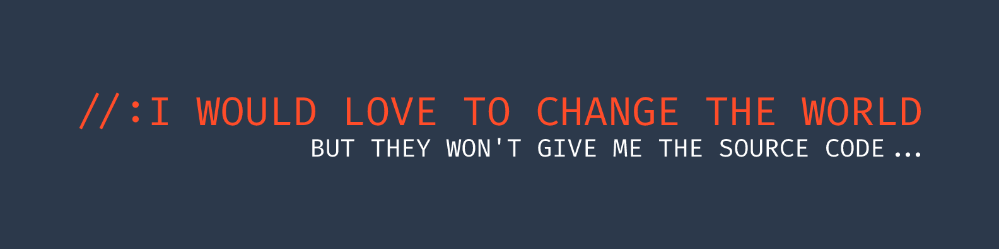

# Hi, welcome to my GitHub! 

I'm Thiago Hiroaki Chinen, a passionate software developer, who solves problems through programming.

My goal is to make a difference by building high-quality applications that meet needs, exceed expectations and most importantly have a positive impact on people or the world, solving problems and making things easier.

I'm a fan of books, comics, manga, philosophy, jiu-jitsu, games, movies, series, and anime, a true geek.

If you're looking for a dedicated developer passionate about technology, ready to tackle new challenges, and find ways to solve problems, feel free to contact me. I'm looking forward to exchanging ideas and exploring how we can collaborate to create impactful solutions.

  Let's turn abstract ideas into reality.
   
  Let's make it happen!

## How to Reach Me

- [💬 LinkedIn](https://www.linkedin.com/in/thiago-chinen-bb506b26a/)
- [📧 Email](mailto:thiagochinen2015@gmail.com)
- [💻 Website](https://portfolio-delta-ebon.vercel.app/pt/home)
